# Heimdall executable full-stack statechart

This document is generated from `tests/contracts/heimdall-statechart.mjs`. The same declarations drive the UI, hidden-state, FOUC, and backend response-oracle tests.

Coverage: 44 navigation states, 6 preference states, 11 hidden/portal states, and 10 backend lifecycle/contract states.

```mermaid
stateDiagram-v2
  state UI {
    [*] --> ui_booting
    ui_booting --> ui_ready: portal + styles + fonts ready
    state Navigation {
      state "Nodes" as ui_navigation_nodes
      state "Workloads / Overview" as ui_navigation_workloads_overview
      state "Workloads / Pods" as ui_navigation_workloads_pods
      state "Workloads / Deployments" as ui_navigation_workloads_deployments
      state "Workloads / Daemon Sets" as ui_navigation_workloads_daemon_sets
      state "Workloads / Stateful Sets" as ui_navigation_workloads_stateful_sets
      state "Workloads / Replica Sets" as ui_navigation_workloads_replica_sets
      state "Workloads / Replication Controllers" as ui_navigation_workloads_replication_controllers
      state "Workloads / Jobs" as ui_navigation_workloads_jobs
      state "Workloads / Cron Jobs" as ui_navigation_workloads_cron_jobs
      state "Config / ConfigMaps" as ui_navigation_config_configmaps
      state "Config / Secrets" as ui_navigation_config_secrets
      state "Config / Resource Quotas" as ui_navigation_config_resource_quotas
      state "Config / Limit Ranges" as ui_navigation_config_limit_ranges
      state "Config / Horizontal Pod Autoscalers" as ui_navigation_config_horizontal_pod_autoscalers
      state "Config / Vertical Pod Autoscalers" as ui_navigation_config_vertical_pod_autoscalers
      state "Config / Pod Disruption Budgets" as ui_navigation_config_pod_disruption_budgets
      state "Config / Pod Security Policies" as ui_navigation_config_pod_security_policies
      state "Config / Priority Classes" as ui_navigation_config_priority_classes
      state "Config / Leases" as ui_navigation_config_leases
      state "Config / Runtime Classes" as ui_navigation_config_runtime_classes
      state "Config / Mutating Webhook Configurations" as ui_navigation_config_mutating_webhook_configurations
      state "Config / Validating Webhook Configurations" as ui_navigation_config_validating_webhook_configurations
      state "Config / Validating Admission Policies" as ui_navigation_config_validating_admission_policies
      state "Config / Validating Admission Policy Bindings" as ui_navigation_config_validating_admission_policy_bindings
      state "Network / Services" as ui_navigation_network_services
      state "Network / Ingresses" as ui_navigation_network_ingresses
      state "Network / Ingress Classes" as ui_navigation_network_ingress_classes
      state "Network / Network Policies" as ui_navigation_network_network_policies
      state "Network / Endpoints" as ui_navigation_network_endpoints
      state "Network / Endpoint Slices" as ui_navigation_network_endpoint_slices
      state "Storage / Persistent Volume Claims" as ui_navigation_storage_persistent_volume_claims
      state "Storage / Persistent Volumes" as ui_navigation_storage_persistent_volumes
      state "Storage / Storage Classes" as ui_navigation_storage_storage_classes
      state "Namespaces" as ui_navigation_namespaces
      state "Events" as ui_navigation_events
      state "Helm / Charts" as ui_navigation_helm_charts
      state "Helm / Releases" as ui_navigation_helm_releases
      state "Access Control / Roles" as ui_navigation_access_control_roles
      state "Access Control / Cluster Roles" as ui_navigation_access_control_cluster_roles
      state "Access Control / Role Bindings" as ui_navigation_access_control_role_bindings
      state "Access Control / Cluster Role Bindings" as ui_navigation_access_control_cluster_role_bindings
      state "Access Control / Service Accounts" as ui_navigation_access_control_service_accounts
      state "Custom Resources / Custom Resource Definitions" as ui_navigation_custom_resources_custom_resource_definitions
    }
    state Preferences {
      state "App" as ui_preferences_app
      state "Proxy" as ui_preferences_proxy
      state "Kubernetes" as ui_preferences_kubernetes
      state "Editor" as ui_preferences_editor
      state "Terminal" as ui_preferences_terminal
      state "Extensions" as ui_preferences_extensions
    }
    state Hidden_and_portal_states {
      state "namespace menu" as ui_overlay_namespace_menu_open
      state "search tooltip" as ui_overlay_search_tooltip
      state "pod row menu" as ui_overlay_pod_row_menu_open
      state "pod details drawer" as ui_overlay_pod_details_open
      state "dock new tab menu" as ui_overlay_dock_new_tab_menu_open
      state "open dock" as ui_overlay_dock_open
      state "sidebar cluster menu" as ui_overlay_sidebar_cluster_menu_open
      state "create resource dialog" as ui_overlay_create_resource_dialog_open
      state "preferences dialog" as ui_overlay_preferences_dialog_open
      state "connect dialog" as ui_overlay_connect_dialog_open
      state "open and closed shadow roots" as ui_overlay_shadow_root_mounted
    }
    ui_ready --> Navigation: navigate
    ui_ready --> Preferences: open preferences
    Navigation --> Hidden_and_portal_states: open overlay
    Hidden_and_portal_states --> Navigation: close
  }
  state Backend {
    [*] --> backend_booting
    backend_booting --> backend_ready: worker ready
    backend_ready --> backend_worker_router_ready: request
    backend_worker_router_ready --> backend_ready: settled
    backend_ready --> backend_worker_no_content: request
    backend_worker_no_content --> backend_ready: settled
    backend_ready --> backend_worker_validated_ready: request
    backend_worker_validated_ready --> backend_ready: settled
    backend_ready --> backend_kube_method_rejected: request
    backend_kube_method_rejected --> backend_ready: settled
    backend_ready --> backend_kube_cluster_missing: request
    backend_kube_cluster_missing --> backend_ready: settled
    backend_ready --> backend_kube_server_invalid: request
    backend_kube_server_invalid --> backend_ready: settled
    backend_ready --> backend_kube_insecure_rejected: request
    backend_kube_insecure_rejected --> backend_ready: settled
    backend_ready --> backend_kube_path_rejected: request
    backend_kube_path_rejected --> backend_ready: settled
  }
```

Run `npm run test:statechart` to validate reachability and execute the UI/backend state oracles. Run `npm run statechart:generate` after changing the machine.
